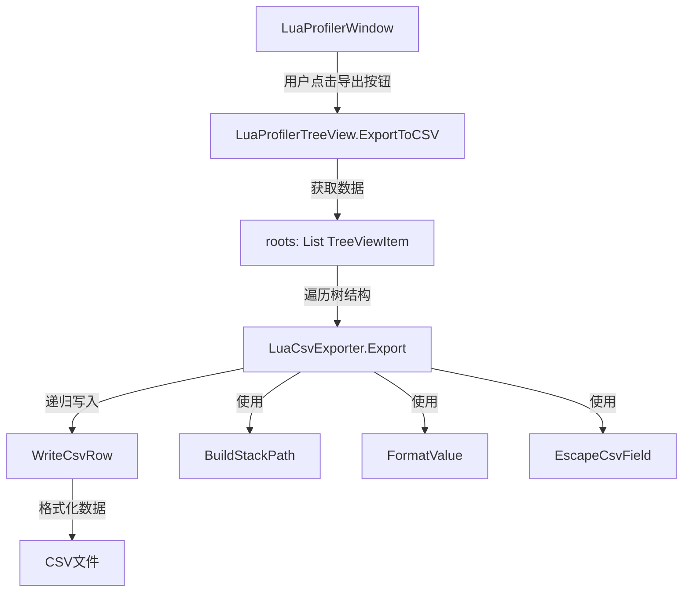

# Lua Profiler CSV 导出功能设计方案

## 项目概述

基于现有的 MikuLuaProfiler 项目，添加 CSV 导出功能，支持导出详细的堆栈信息和性能统计数据。

## 数据分析

### 现有数据结构

#### Sample 类 (Runtime/Core/NetWork/Packet/Sample.cs)
核心性能采样数据类，包含以下关键字段：

**基础信息:**
- `name` - 函数名称
- `fullName` - 完整调用路径名称
- `calls` - 调用次数
- `frameCount` - 帧计数
- `fps` - 帧率
- `pss` - 进程内存 (PSS)
- `power` - 功耗

**性能指标:**
- `costTime` - 总耗时 (微秒)
- `selfCostTime` - 自身耗时 (不包含子调用)
- `costLuaGC` - Lua GC 消耗
- `selfLuaGC` - 自身 Lua GC 消耗
- `costMonoGC` - Mono GC 消耗
- `selfMonoGC` - 自身 Mono GC 消耗

**内存信息:**
- `currentLuaMemory` - 当前 Lua 内存
- `currentMonoMemory` - 当前 Mono 内存

**层级结构:**
- `_father` - 父节点
- `childs` - 子节点列表 (树形结构)
- `currentTime` - 当前时间戳

#### LuaProfilerTreeViewItem 类 (Editor/Window/ProfilerWin/TreeView/LuaProfilerTreeView.cs)
UI 显示用的树形项，包含聚合后的统计信息：

- `totalTime` - 累计总时间
- `averageTime` - 平均时间
- `totalCallTime` - 累计调用次数
- `totalLuaMemory` / `selfLuaMemory` - 累计/自身 Lua 内存
- `totalMonoMemory` / `selfMonoMemory` - 累计/自身 Mono 内存
- `filePath` - 文件路径 (针对 Lua 函数)
- `line` - 行号 (针对 Lua 函数)
- `isLua` - 是否为 Lua 函数
- `isError` - 是否为错误

### 现有的保存功能

项目已有的保存功能 (SaveResult/LoadHistory)：
- 使用二进制序列化保存 Sample 对象
- 保存为 .sample 文件格式
- 通过 `Sample.SerializeList()` 进行序列化

## CSV 导出需求

### 功能要求

1. **详细堆栈信息**：导出完整的函数调用栈，包括父子关系
2. **性能统计**：导出所有性能指标 (时间、内存、GC 等)
3. **层级结构**：通过缩进或路径表示调用层次
4. **可读性**：CSV 格式便于在 Excel 等工具中分析

### CSV 格式设计

#### 方案一：扁平化带缩进 (推荐)

```csv
Depth,Stack Path,Function Name,File Path,Line,Is Lua,Calls,Total Time(ms),Self Time(ms),Avg Time(ms),Total Lua GC(B),Self Lua GC(B),Total Mono GC(B),Self Mono GC(B),Frame Count,FPS,PSS(KB),Power
0,Root,Root,,,false,1,1000.5,10.2,1000.5,2048,512,4096,1024,100,60,12345,0.5
1,Root>Update,Update,MainLoop.cs,45,false,100,990.3,50.1,9.903,1536,256,3072,768,100,60,12345,0.5
2,Root>Update>LuaFunc,[lua]: GameLogic.lua&line:123,GameLogic.lua,123,true,500,940.2,850.0,1.880,1280,1024,2304,2048,100,60,12345,0.5
```

#### 方案二：完整堆栈路径

```csv
Full Stack,Depth,Function Name,File Path,Line,Is Lua,Calls,Total Time(ms),Self Time(ms),Avg Time(ms),Total Lua GC(B),Self Lua GC(B),Total Mono GC(B),Self Mono GC(B),Frame Count,FPS,PSS(KB),Power
Root,0,Root,,,false,1,1000.5,10.2,1000.5,2048,512,4096,1024,100,60,12345,0.5
Root>Update,1,Update,MainLoop.cs,45,false,100,990.3,50.1,9.903,1536,256,3072,768,100,60,12345,0.5
Root>Update>LuaFunc,2,[lua]: GameLogic.lua&line:123,GameLogic.lua,123,true,500,940.2,850.0,1.880,1280,1024,2304,2048,100,60,12345,0.5
```

**推荐使用方案二**，因为：
- 完整堆栈路径更易于数据透视和筛选
- 可以直接看到完整调用链
- 便于按路径分组统计

### CSV 列定义

| 列名 | 说明 | 数据源 | 格式 |
|-----|------|--------|------|
| Full Stack | 完整堆栈路径 | 递归构建父路径 | `Parent>Child>...` |
| Depth | 调用深度 | TreeViewItem.depth | 整数 |
| Function Name | 函数名称 | Sample.name | 字符串 |
| File Path | 文件路径 | TreeViewItem.filePath | 字符串 |
| Line | 行号 | TreeViewItem.line | 整数 |
| Is Lua | 是否Lua函数 | TreeViewItem.isLua | true/false |
| Calls | 调用次数 | TreeViewItem.totalCallTime | 整数 |
| Total Time (ms) | 总耗时(毫秒) | TreeViewItem.totalTime / 1000 | 浮点数(3位小数) |
| Self Time (ms) | 自身耗时(毫秒) | TreeViewItem.selfCostTime / 1000 | 浮点数(3位小数) |
| Avg Time (ms) | 平均耗时(毫秒) | TreeViewItem.averageTime / 1000 | 浮点数(3位小数) |
| Total Lua GC (B) | 累计Lua GC | TreeViewItem.totalLuaMemory | 整数 |
| Self Lua GC (B) | 自身Lua GC | TreeViewItem.selfLuaMemory | 整数 |
| Total Mono GC (B) | 累计Mono GC | TreeViewItem.totalMonoMemory | 整数 |
| Self Mono GC (B) | 自身Mono GC | TreeViewItem.selfMonoMemory | 整数 |
| Frame Count | 帧计数 | Sample.frameCount | 整数 |
| FPS | 帧率 | Sample.fps | 浮点数(2位小数) |
| PSS (KB) | 进程内存(KB) | Sample.pss | 整数 |
| Power | 功耗 | Sample.power | 浮点数(2位小数) |

## 实现方案

### 架构设计



### 文件结构

创建新文件：
```
Editor/
  Window/
    ProfilerWin/
      TreeView/
        LuaCsvExporter.cs          # CSV 导出核心类 (新建)
        LuaProfilerTreeView.cs     # 添加 ExportToCSV 方法
        LuaProfilerWindow.cs       # 添加导出按钮
```

### 实现细节

#### 1. LuaCsvExporter 类

**职责**：负责将 TreeViewItem 转换为 CSV 格式并写入文件

**主要方法**：

```csharp
public class LuaCsvExporter
{
    // 导出主方法
    public static void ExportToCSV(string filePath, List<LuaProfilerTreeViewItem> roots)
    
    // 递归遍历树结构并写入CSV行
    private static void WriteTreeItemRecursive(
        StreamWriter writer, 
        LuaProfilerTreeViewItem item, 
        string parentPath, 
        int depth)
    
    // 构建完整堆栈路径
    private static string BuildStackPath(string parentPath, string currentName)
    
    // 格式化单个CSV字段 (处理特殊字符、引号等)
    private static string EscapeCsvField(string field)
    
    // 格式化时间值 (微秒转毫秒)
    private static string FormatTime(long microseconds)
    
    // 格式化内存值 (字节)
    private static string FormatMemory(long bytes)
    
    // 写入CSV头部
    private static void WriteHeader(StreamWriter writer)
    
    // 写入单行数据
    private static void WriteDataRow(
        StreamWriter writer,
        string fullStack,
        int depth,
        LuaProfilerTreeViewItem item,
        Sample sampleData)
}
```

**关键实现点**：

1. **CSV 特殊字符处理**：
   - 字段包含逗号、引号或换行符时需要用双引号包围
   - 引号需要转义为两个引号 `""`
   
2. **编码问题**：
   - 使用 UTF-8 with BOM 编码，确保中文和特殊字符正确显示
   - Excel 可以正确识别

3. **数值格式化**：
   - 时间：微秒转毫秒，保留3位小数
   - 内存：字节数，整数
   - FPS/Power：保留2位小数

4. **堆栈路径构建**：
   - 使用 `>` 作为分隔符
   - 递归向上构建完整路径
   - 处理 Root 节点特殊情况

#### 2. LuaProfilerTreeView 修改

**添加方法**：

```csharp
public void ExportToCSV()
{
    string path = EditorUtility.SaveFilePanel(
        "Export Profiler Data to CSV", 
        "", 
        DateTime.Now.ToString("yyyy-MM-dd-HH-mm-ss") + "_profiler", 
        "csv");
    
    if (string.IsNullOrEmpty(path)) return;
    
    try
    {
        LuaCsvExporter.ExportToCSV(path, roots);
        EditorUtility.DisplayDialog(
            "Export Success", 
            $"Profiler data exported to:\n{path}", 
            "OK");
    }
    catch (Exception ex)
    {
        EditorUtility.DisplayDialog(
            "Export Failed", 
            $"Failed to export CSV:\n{ex.Message}", 
            "OK");
        Debug.LogError($"CSV Export Error: {ex}");
    }
}
```

#### 3. LuaProfilerWindow UI 修改

**在 DoToolbar 方法中添加导出按钮**：

```csharp
// 在 Save/Load 按钮附近添加
GUILayout.Space(5);
bool isExportCsv = GUILayout.Button("Export CSV", EditorStyles.toolbarButton, GUILayout.Height(30), GUILayout.Width(80));
if (isExportCsv)
{
    m_TreeView.ExportToCSV();
}
```

**按钮位置建议**：
- 放在现有的 "Save" 和 "Load" 按钮旁边
- 同样在非录制模式下显示 (`if (!LuaDeepProfilerSetting.Instance.isRecord)`)

### 数据获取策略

#### 当前显示的数据 vs 完整历史数据

**方案一：导出当前显示的根节点** (推荐)
```csharp
// 导出 m_TreeView.roots 中的数据
// 优点：简单直接，对应当前显示内容
// 缺点：只有聚合后的数据
LuaCsvExporter.ExportToCSV(path, roots);
```

**方案二：导出完整历史样本**
```csharp
// 导出 m_TreeView.history 中的所有 Sample
// 优点：完整的原始数据，包含所有采样帧
// 缺点：数据量大，需要逐帧导出
```

**推荐实现方案一**，理由：
- 用户通常关心聚合后的统计数据
- 数据量适中，易于分析
- 对应 UI 显示内容，用户更易理解
- 后续可扩展支持导出历史数据

### 示例输出

**示例 CSV 内容**：
```csv
Full Stack,Depth,Function Name,File Path,Line,Is Lua,Calls,Total Time(ms),Self Time(ms),Avg Time(ms),Total Lua GC(B),Self Lua GC(B),Total Mono GC(B),Self Mono GC(B)
Root,0,Root,,,false,1,5420.150,125.340,5420.150,2048000,51200,4096000,102400
Root>GameLoop.Update,1,GameLoop.Update,GameLoop.cs,45,false,180,5294.810,89.450,29.415,1996800,38400,3993600,76800
Root>GameLoop.Update>LuaUpdate,2,[lua]: game_main.lua&line:123,game_main.lua,123,true,180,5205.360,2845.120,28.918,1958400,1228800,3916800,2457600
Root>GameLoop.Update>LuaUpdate>ProcessEvent,3,[lua]: event_mgr.lua&line:56,event_mgr.lua,56,true,540,2360.240,1680.180,4.370,729600,524288,1459200,1048576
```

## 实现步骤

### 阶段一：核心导出功能
1. ✅ 分析现有数据结构
2. ⬜ 创建 `LuaCsvExporter.cs` 类
3. ⬜ 实现 CSV 头部写入
4. ⬜ 实现单行数据写入
5. ⬜ 实现 CSV 特殊字符转义

### 阶段二：树结构遍历
6. ⬜ 实现递归遍历 TreeViewItem
7. ⬜ 实现堆栈路径构建
8. ⬜ 实现深度跟踪

### 阶段三：数据格式化
9. ⬜ 实现时间格式化 (微秒→毫秒)
10. ⬜ 实现内存格式化
11. ⬜ 实现数值精度控制

### 阶段四：UI 集成
12. ⬜ 在 LuaProfilerTreeView 添加 ExportToCSV 方法
13. ⬜ 在 LuaProfilerWindow 添加导出按钮
14. ⬜ 添加文件保存对话框
15. ⬜ 添加成功/失败提示

### 阶段五：测试与优化
16. ⬜ 测试基本导出功能
17. ⬜ 测试特殊字符处理 (逗号、引号、换行)
18. ⬜ 测试中文文件名和路径
19. ⬜ 测试大数据量导出
20. ⬜ 测试 Excel 兼容性
21. ⬜ 优化性能 (大数据集)

## 技术要点

### CSV 格式规范

1. **RFC 4180 标准**：
   - 每行以 CRLF (`\r\n`) 结束
   - 字段用逗号分隔
   - 包含特殊字符的字段用双引号包围
   - 双引号转义为 `""`

2. **Excel 兼容性**：
   - UTF-8 with BOM (`0xEF 0xBB 0xBF`)
   - 避免科学计数法 (长数字可加前缀 `'`)

### 性能考虑

1. **大数据集优化**：
   - 使用 `StringBuilder` 拼接行数据
   - 使用 `StreamWriter` 缓冲写入
   - 避免频繁的字符串分配

2. **内存管理**：
   - 逐行写入，不在内存中累积全部内容
   - 及时释放 StreamWriter 资源

3. **进度反馈**：
   - 大数据量时显示进度条
   - 使用 `EditorUtility.DisplayProgressBar`

### 错误处理

1. **文件 I/O 错误**：
   - 文件路径无效
   - 磁盘空间不足
   - 权限不足

2. **数据异常**：
   - 空数据处理
   - 异常值处理 (null, NaN, Infinity)

3. **用户取消**：
   - SaveFilePanel 取消
   - 导出过程中断

## 扩展功能 (可选)

### 未来可能的增强

1. **多种导出格式**：
   - JSON 格式 (便于程序处理)
   - XML 格式 (结构化)
   - HTML 报告 (可视化)

2. **自定义导出选项**：
   - 选择导出的列
   - 过滤条件 (只导出特定类型/性能阈值)
   - 排序选项

3. **高级功能**：
   - 对比两次采样的差异导出
   - 聚合统计报告
   - 时间线导出 (按帧)

4. **数据分析**：
   - 生成性能热点报告
   - 调用关系图
   - 趋势分析

## 总结

本方案设计了一个完整的 CSV 导出功能，核心特点：

- ✅ **详细堆栈**：完整的函数调用链路径
- ✅ **丰富指标**：时间、内存、GC、FPS 等全面指标
- ✅ **易于分析**：标准 CSV 格式，Excel 友好
- ✅ **层次清晰**：通过 Depth 和 Full Stack 表达调用关系
- ✅ **易于扩展**：模块化设计，便于添加新功能

实现后，用户可以：
1. 点击 "Export CSV" 按钮
2. 选择保存位置
3. 在 Excel 或其他工具中打开分析
4. 进行数据透视、筛选、图表等深度分析
